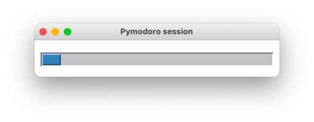

<p align="center">
📣 <i>Updated to work on newest macOS versions</i>
</p>

---


# Pymodoro
Pomodoro timer for macOS, which turns on the DND (Do Not Disturb) mode for the pomodoro's duration.

### Prerequisites

#### macOS

This program is intended to work only on Apple macOS operating system.

#### macos-focus-mode

This project uses the [`macos-focus-mode`](https://github.com/arodik/macos-focus-mode)
node.js program to control the macOS DND mode.

You need to have it installed globally for Pymodoro to work correcty.

```
$ npm i -g macos-focus-mode
```

#### Python 3

To run Pymodoro you need to have [Python 3 installed](https://www.python.org/downloads/).

### Usage

Run Pymodoro from the command line, passing in a single argument
specifying the duration of the pomodoro.

Pymodoro will enable the DND macOS mode for that time to block all
notifications and allow you to work peacefully.

Example use:
```commandline
$ python3 pymodoro.py 25
```

#### Progress bar
After starting a session a progress bar will appear:


If you don't wish to see it you can use the `--no-progress` flag:
```commandline
$ python3 pymodoro.py 25 --no-progress
```

This will result in a command line output:
```
Pomodoro started, you have 25 minutes
DND on
25 minutes left
24 minutes left
(...)
2 minutes left
1 minutes left
Pomodoro finished
DND off
```

#### Popup

Additionally, at the end of the session a popup will appear,
to clearly indicate a break:


To turn it off, run Pymodoro with the `--no-popup` flag:
```commandline
$ python3 pymodoro.py 25 --no-popup
```

#### Voice
There will also be a voice reading out loud end of the pomodoro.
To turn it off, run Pymodoro with the `--no-sound` flag:
```commandline
$ python3 pymodoro.py 25 --no-sound
```

#### Chaining flags
Note that you can chain all the flags. For example,
the command below will result in a session with no
progress, no popup and no voice:
```commandline
python3 pymodoro.py 25 --no-progress --no-popup --no-sound
```
