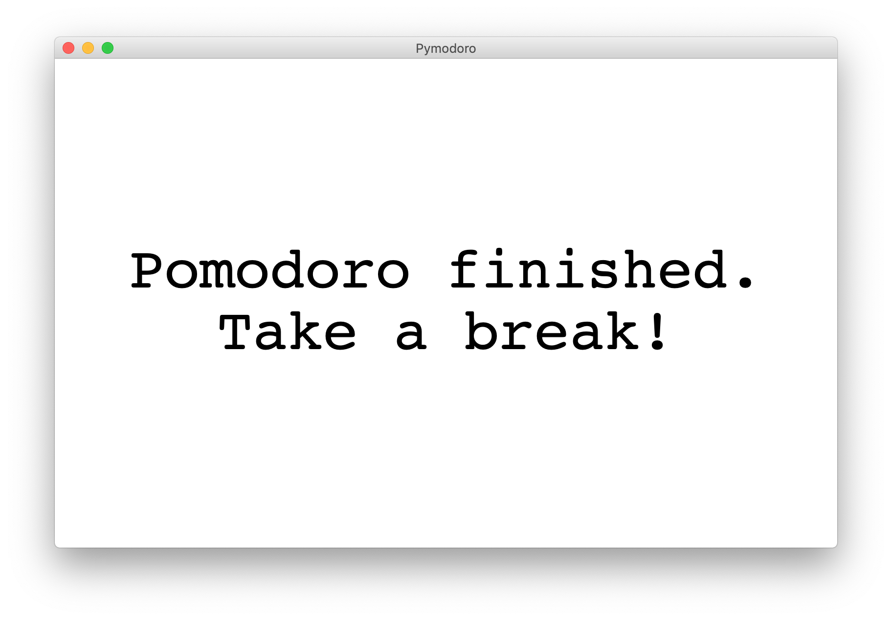

# Pymodoro
Pomodoro timer for macOS, which turns on the DND (Do Not Disturb) mode for the pomodoro's duration.

### Prerequisites

#### do-not-disturb-cli

This project uses the [`macos-focus-mode`](https://github.com/arodik/macos-focus-mode)
node.js program to control the macOS DND mode.

You need to have it installed globally for Pymodoro to work correcty.

```
$ npm i -g macos-focus-mode
```

#### Python 3

To run Pymodoro you need to have [Python 3 installed](https://www.python.org/downloads/).

### Usage

Run Pymodoro from the command line, passing in a single argument
specifying the duration of the pomodoro.

Pymodoro will enable the DND macOS mode for that time to block all
notifications and allow you to work peacefully.

Example use:
```
$ python3 pymodoro.py 25
```

Output:
```
Pomodoro started, you have 25 minutes
DND on
25 minutes left
24 minutes left
(...)
2 minutes left
1 minutes left
Pomodoro finished
DND off
```

#### Voice
There will also be a voice reading out loud the start and the
end of the pomodoro, as well as when 20% of the time is left.

To turn it off, run Pymodoro with the `--no-sound` flag:
```
$ python3 pymodoro.py 25 --no-sound
```

#### Popup
At the end of the pomodoro you will also be alerted with
a popup:



To turn it off, run Pymodoro with the `--no-popup` flag:
```
$ python3 pymodoro.py 25 --no-popup
```